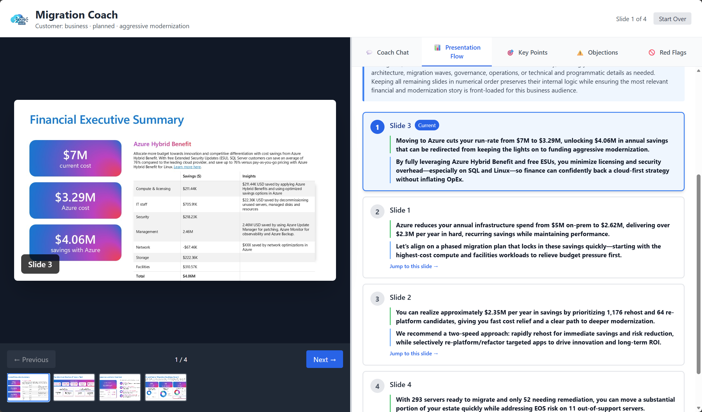

# Migration Coach 🚀

An AI-powered sales coaching platform that helps sellers deliver compelling migration assessment presentations tailored to each customer's unique context.



## What is Migration Coach?

Migration Coach is an interactive training tool that simulates real customer interactions, helping sales professionals practice and perfect their migration assessment presentations. Using Azure OpenAI, it provides real-time coaching feedback based on customer context, slide content, and sales best practices.

## Key Features

### 🎯 Customer Discovery
Before the presentation, the coach guides you through a discovery process to understand:
- Customer's urgency level and timeline
- Modernization appetite
- Audience type (technical vs business)
- Budget sensitivity
- Specific pain points

### 🎤 Interactive Presentation Practice
- **Real-time Coaching**: Get immediate feedback on your responses
- **Slide-by-Slide Guidance**: Practice with actual presentation materials
- **OCR Integration**: Automatically extracts slide content using Azure Document Intelligence
- **Adaptive Flow**: AI optimally orders slides based on customer context

### 🧠 Intelligent AI Coach
The coach provides:
- **Direct, challenging feedback** - pushes sellers to excellence
- **Context-aware responses** - tailored to customer situation
- **Red flag detection** - calls out weak language or problematic statements
- **Specific guidance** - demands confidence and specificity

### 📊 Multi-Tab Interface
- **Chat**: Interactive coaching conversation
- **Key Points**: Important messages for the current slide
- **Objections**: Potential customer concerns to address
- **Red Flags**: What NOT to say
- **Flow**: AI-generated presentation order with reasoning

## Technology Stack

### Frontend
- **React 19** with TypeScript
- **Vite** for fast development
- **Tailwind CSS** for styling
- **Azure Document Intelligence** for OCR

### AI & Azure Services
- **Azure OpenAI** (GPT-4) for coaching intelligence
- **Azure Document Intelligence** for slide text extraction
- Configurable through environment variables

## Getting Started

### Prerequisites
- Node.js (v18+)
- Azure OpenAI access
- Azure Document Intelligence access

### Installation

1. Clone the repository:
```bash
git clone https://github.com/crgarcia12/migration-coach.git
cd migration-coach/src/frontend
```

2. Install dependencies:
```bash
npm install
```

3. Configure environment variables:
Create a `.env` file in `src/frontend`:
```env
VITE_AZURE_OPENAI_ENDPOINT=https://zzzzzzzzzzzzzzz-resource.cognitiveservices.azure.com
VITE_AZURE_OPENAI_API_KEY=
VITE_AZURE_OPENAI_DEPLOYMENT=gpt-5.1
```

4. Run the development server:
```bash
npm run dev
```

5. Open your browser to `http://localhost:5173`

## How It Works

1. **Discovery Phase**: Answer questions about your customer to establish context
2. **AI Processing**: The system:
   - Extracts text from all slides using OCR
   - Generates an optimized presentation flow
   - Creates talking points for each slide
3. **Practice Mode**: Navigate through slides, respond to coaching prompts
4. **Real-time Feedback**: Get challenging, context-aware coaching on your responses

## Project Structure

```
src/frontend/
├── src/
│   ├── components/
│   │   ├── CoachingInterface.tsx  # Main coaching interface
│   │   └── CustomerDiscovery.tsx  # Customer context gathering
│   ├── utils/
│   │   ├── azureAICoach.ts        # Azure OpenAI integration
│   │   ├── slideOCR.ts            # Document Intelligence OCR
│   │   ├── presentationFlow.ts    # AI flow generation
│   │   └── coachingEngine.ts      # Fallback coaching logic
│   ├── data/
│   │   └── slides.ts              # Sample presentation slides
│   └── types/
│       └── index.ts               # TypeScript definitions
└── public/
    └── slides/                    # Presentation slide images
```

## Key Components

### Customer Context
Captures essential customer information:
- Urgency and timeline
- Modernization appetite
- Audience characteristics
- Budget sensitivity
- Specific pain points

### Slide Intelligence
Each slide includes:
- Key talking points
- Potential objections
- Red flags to avoid
- OCR-extracted content

### AI Coach Personality
- **Assertive and challenging** - pushes for excellence
- **Context-aware** - tailors feedback to customer situation
- **Specific and demanding** - calls out weak language
- **Results-focused** - demands confidence and clarity

## Development

### Build for Production
```bash
npm run build
```

### Run Linter
```bash
npm run lint
```

### Preview Production Build
```bash
npm run preview
```

## Contributing

Contributions are welcome! Please feel free to submit a Pull Request.

## License

This project is licensed under the MIT License.

## Acknowledgments

Built with Azure AI services to help sales professionals deliver exceptional migration assessment presentations.
